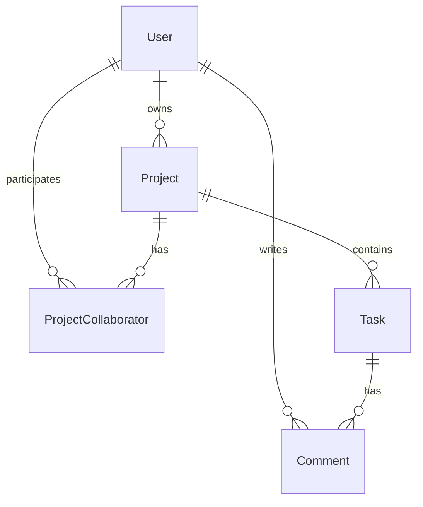
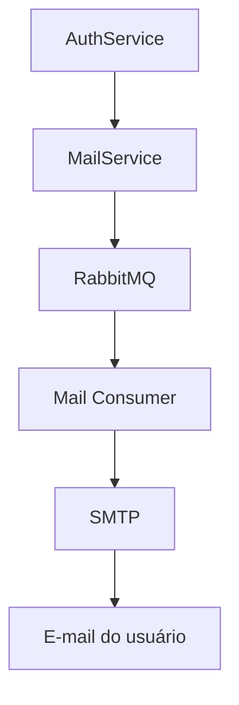
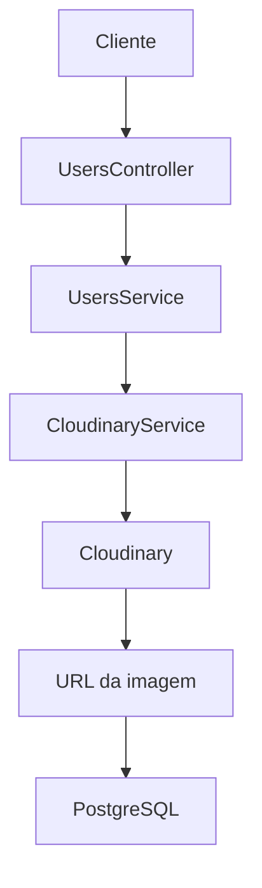

  

<h3 align="center">Project Management API</h3>

[Funcionalidades](#️-principais-funcionalidades) • [Instalação](#-instalação) • [Documentação](#-documentação-da-api) • [Autenticação](#-autenticação) • [Endpoints](#-endpoints) • [Paginação e filtros](#-paginação-e-filtros) • [Banco de dados](#️-banco-de-dados) • [RabbitMQ e envio de e-mails](#-rabbitmq-e-envio-de-e-mails) • [Upload de avatar](#️-upload-de-avatar) •  [Segurança](#-segurança)

---

 
    API REST desenvolvida com NestJS para gerenciamento de usuários, projetos, tarefas, comentários e colaboradores.
      

## 📃 Descrição

Uma aplicação backend desenvolvida para fornecer uma estrutura completa de gerenciamento de projetos e tarefas.

O sistema permite que usuários criem projetos, adicionem colaboradores, criem tarefas, atribuam responsáveis e adicionem comentários às tarefas. A aplicação também possui autenticação, recuperação de senha, upload de avatar e controle de acesso.

O projeto foi desenvolvido com **NestJS e TypeScript**, utilizando uma arquitetura modular para separar as responsabilidades da aplicação. O acesso ao banco de dados é realizado através do **Prisma ORM**, utilizando **PostgreSQL**.

Além disso, foram utilizadas tecnologias como **JWT** para autenticação, **RabbitMQ** para comunicação assíncrona, **Cloudinary** para armazenamento de imagens e **SMTP** para envio de e-mails.

### 🛠️ Tecnologias

### 🏗️ Principais funcionalidades

- Cadastro de usuários
- Autenticação utilizando JWT
- Login e logout
- Recuperação e alteração de senha
- Gerenciamento de usuários
- Gerenciamento de projetos
- Gerenciamento de tarefas
- Gerenciamento de comentários
- Gerenciamento de colaboradores
- Controle de permissões
- Upload de avatar
- Envio de e-mails
- Comunicação assíncrona com RabbitMQ
- Paginação
- Ordenação
- Filtros dinâmicos
- Soft delete
- Validação de dados
- Serialização das respostas
- Documentação através do Swagger

---

# 📦 Instalação

## Pré-requisitos

Antes de executar o projeto, você precisa ter:

- [Node.js](https://nodejs.org/)
- [npm](https://www.npmjs.com/)
- [PostgreSQL](https://www.postgresql.org/)
- [MailTrap](https://mailtrap.io/)
- [RabbitMQ](https://www.cloudamqp.com/)
- [Cloudinary](https://console.cloudinary.com/app/product-explorer)

## 1. Clone o repositório
    git clone <URL_DO_REPOSITORIO>
    cd curso_nestjs

## 2. Dependências
    npm install

## 3. Configure as variáveis de ambiente
    # Database settings
    DATABASE_URL=

    # JWT settings
    JWT_SECRET=

    # Mail settings
    SMTP_HOST=
    SMTP_PORT=
    SMTP_USER=
    SMTP_PASS=

    # RabbitMQ settings
    RABBITMQ_URL=

    # Cloudinary settings
    CLOUDINARY_CLOUD_NAME=
    CLOUDINARY_API_KEY=
    CLOUDINARY_API_SECRET=

    # Cookie settings
    NODE_ENV=

## 4. Configure o Prisma
    npx prisma migrate dev
    npx prisma generate

## 5. Execute a aplicação
    npm run start:dev

---

# 📚 Documentação da API

A API possui documentação interativa utilizando Swagger.

Depois de iniciar a aplicação, acesse:

    http://localhost:3000/api

Através do Swagger é possível visualizar os endpoints, parâmetros, modelos de dados e realizar requisições diretamente pela interface.

---

# 🔐 Autenticação

A autenticação da aplicação utiliza JWT.

Após o login, o token de autenticação é armazenado em um cookie chamado:

    access_token

As rotas protegidas utilizam o JwtAuthGuard para validar o usuário autenticado.

---

# 🔌 Endpoints

A API utiliza o prefixo de versão:

    /v1

## 🔑 Auth

### Criar usuário

    POST /v1/auth/sign-up

Body

    {
      "name": "Wendel",
      "email": "wendel@email.com",
      "password": "12345678"
    }

Response

    {
      "message": "Signed up successfully"
    }

### Login

    POST /v1/auth/sign-in

Body

    {
      "email": "wendel@email.com",
      "password": "12345678"
    }

Response

    {
      "message": "Signed in successfully"
    }

Após o login, o JWT é armazenado no cookie access_token.

### Logout

    POST /v1/auth/logout

Response

    {
      "message": "Logout successful"
    }

Após o logout, o JWT é limpo.

### Usuário autenticado

    GET /v1/auth/me

Response

    {
      "id": "uuid",
      "name": "Wendel",
      "email": "wendel@email.com",
      "role": "USER",
      "avatar": null,
      "createdAt": "2026-01-01T00:00:00.000Z",
      "updatedAt": "2026-01-01T00:00:00.000Z",
      "deletedAt": null
    }

A senha do usuário não é retornada na resposta.

### Solicitar recuperação de senha

    POST /v1/auth/forgot-
    
Body

    {
      "email": "wendel@email.com"
    }

Response

    {
      "message": "Password request email sent"
    }

### Redefinir senha

    POST /v1/auth/reset-password

Body

    {
      "token": "TOKEN_RECEBIDO_POR_EMAIL",
      "newPassword": "123456789"
    }

Response

    {
      "message": "Password updated"
    }

### Alterar senha

    POST /v1/auth/change-password

Body

    {
      "currentPassword": "12345678",
      "newPassword": "87654321"
    }

Response

    {
      "message": "Password updated"
    }

## 👤 Users

### Listar usuários

    GET /v1/users

Query parameters

    ?page=1
    &perPage=10
    &sortBy=name
    &sortOrder=asc

Exemplo

    GET /v1/users?page=1&perPage=10&sortBy=name&sortOrder=asc

Response

    [
      {
        "id": "uuid",
        "name": "Wendel",
        "email": "wendel@email.com",
        "role": "USER",
        "avatar": null,
        "createdAt": "2026-01-01T00:00:00.000Z",
        "updatedAt": "2026-01-01T00:00:00.000Z",
        "deletedAt": null
      }
    ]

A quantidade total de registros é retornada através do header:

    X-Total-Count

### Buscar usuário

    GET /v1/users/:userId

Exemplo

    GET /v1/users/550e8400-e29b-41d4-a716-446655440000

Response

    {
      "id": "uuid",
      "name": "Wendel",
      "email": "wendel@email.com",
      "role": "USER",
      "avatar": null,
      "createdAt": "2026-01-01T00:00:00.000Z",
      "updatedAt": "2026-01-01T00:00:00.000Z",
      "deletedAt": null
    }

### Atualizar usuário

    PUT /v1/users/:userId

Body

    {
      "name": "Wendel Tavares",
      "email": "wendel.tavares@email.com"
    }

Response

    {
      "id": "uuid",
      "name": "Wendel",
      "email": "wendel@email.com",
      "role": "USER",
      "avatar": null,
      "createdAt": "2026-01-01T00:00:00.000Z",
      "updatedAt": "2026-01-01T00:00:00.000Z",
      "deletedAt": null
    }

### Excluir usuário

    DELETE /v1/users/:userId

A exclusão utiliza soft delete, mantendo o registro no banco de dados e preenchendo o campo deletedAt.

Response

    204 No Content

### Upload de avatar

    POST /v1/users/avatar

A requisição utiliza multipart/form-data.

O campo do arquivo deve ser:

    file

O arquivo é enviado para o Cloudinary e a URL da imagem é armazenada no usuário.

## 📁 Projects

### Listar projetos

    GET /v1/projects

Response

    [
      {
        "id": "uuid",
        "name": "Meu projeto",
        "description": "Projeto para gerenciamento de tarefas",
        "creatorId": "uuid",
        "createdAt": "2026-01-01T00:00:00.000Z",
        "updatedAt": "2026-01-01T00:00:00.000Z",
        "deletedAt": null
      }
    ]

### Buscar projeto

    GET /v1/projects/:projectId

Response

    {
      "id": "uuid",
      "name": "Meu projeto",
      "description": "Projeto para gerenciamento de tarefas",
      "creatorId": "uuid",
      "createdAt": "2026-01-01T00:00:00.000Z",
      "updatedAt": "2026-01-01T00:00:00.000Z",
      "deletedAt": null
    }

### Criar projeto

    POST /v1/projects

Body

    {
      "name": "Meu projeto",
      "description": "Projeto para gerenciamento de tarefas"
    }

Response

    {
      "id": "uuid",
      "name": "Meu projeto",
      "description": "Projeto para gerenciamento de tarefas",
      "creatorId": "uuid",
      "createdAt": "2026-01-01T00:00:00.000Z",
      "updatedAt": "2026-01-01T00:00:00.000Z",
      "deletedAt": null
    }

O usuário que cria o projeto é automaticamente definido como OWNER.

### Atualizar projeto

    PUT /v1/projects/:projectId
    
Body

    {
      "name": "Projeto atualizado",
      "description": "Nova descrição do projeto"
    }

Response

    {
      "id": "uuid",
      "name": "Projeto atualizado",
      "description": "Nova descrição do projeto",
      "creatorId": "uuid",
      "createdAt": "2026-01-01T00:00:00.000Z",
      "updatedAt": "2026-01-01T00:00:00.000Z",
      "deletedAt": null
    }

### Excluir projeto

    DELETE /v1/projects/:projectId

Response

    204 No Content

## ✅ Tasks

### Listar tarefas

    GET /v1/tasks

Para consultar tarefas de um projeto específico:

    GET /v1/tasks?projectId=:projectId

Exemplo

    GET /v1/tasks?projectId=550e8400-e29b-41d4-a716-446655440000

Response

    [
      {
        "id": "uuid", 
        "title": "Minha Tarefa",    
        "description": "Descrição da tarefa", 
        "status": "TODO",
        "priority": "MEDIUM",
        "projectId": "uuid",
        "assigneeId": "uuid",
        "dueDate": "2026-10-01T18:00:00.000Z",
        "createdAt": "2026-01-01T00:00:00.000Z",
        "updatedAt": "2026-01-01T00:00:00.000Z",
        "deletedAt": null 
      }
    ]

### Buscar tarefa

    GET /v1/tasks/:taskId

Response 

    {
      "id": "uuid", 
      "title": "Minha Tarefa",    
      "description": "Descrição da tarefa", 
      "status": "TODO",
      "priority": "MEDIUM",
      "projectId": "uuid",
      "assigneeId": "uuid",
      "dueDate": "2026-10-01T18:00:00.000Z",
      "createdAt": "2026-01-01T00:00:00.000Z",
      "updatedAt": "2026-01-01T00:00:00.000Z",
      "deletedAt": null 
    }

### Criar tarefa

    POST /v1/tasks

Body

    {
      "title": "Implementar autenticação",
      "description": "Criar autenticação utilizando JWT",
      "projectId": "550e8400-e29b-41d4-a716-446655440000"
    }

A tarefa é assinada automaticamente através do usuário autenticado.
Também é possível definir prioridade, status, responsável e data de vencimento:

    {
      "title": "Implementar autenticação",
      "description": "Criar autenticação utilizando JWT",
      "projectId": "uuid",
      "status": "TODO",
      "priority": "HIGH",
      "dueDate": "2026-10-01T18:00:00.000Z"
    }

### Status disponíveis

    TODO
    IN_PROGRESS
    DONE

### Prioridades disponíveis

    LOW
    MEDIUM
    HIGH

Response 

    {
      "id": "uuid", 
      "title": "Implementar autenticação",    
      "description": "Criar autenticação utilizando JWT", 
      "status": "IN_PROGRESS",
      "priority": "HIGH",
      "projectId": "uuid",
      "assigneeId": "uuid",
      "dueDate": "2026-10-01T18:00:00.000Z",
      "createdAt": "2026-01-01T00:00:00.000Z",
      "updatedAt": "2026-01-01T00:00:00.000Z",
      "deletedAt": null 
    }

### Atualizar tarefa

    PUT /v1/tasks/:taskId
    
Body

    {
      "title": "Implementar autenticação JWT",
      "status": "IN_PROGRESS",
      "priority": "HIGH"
    }

Response 

    {
      "id": "uuid", 
      "title": "Implementar autenticação JWT",    
      "description": "Descrição da tarefa", 
      "status": "IN_PROGRESS",
      "priority": "HIGH",
      "projectId": "uuid",
      "assigneeId": "uuid",
      "dueDate": "2026-10-01T18:00:00.000Z",
      "createdAt": "2026-01-01T00:00:00.000Z",
      "updatedAt": "2026-01-01T00:00:00.000Z",
      "deletedAt": null 
    }

### Excluir tarefa

    DELETE /v1/tasks/:taskId

Response

    204 No Content

## 💬 Comments

### Listar comentários

    GET /v1/comments?taskId=:taskId

Response 

    [
      {
        "id": "uuid", 
        "content": "Meu comentário",    
        "authorId": "uuid",
        "taskId": "uuid",
        "createdAt": "2026-01-01T00:00:00.000Z",
        "updatedAt": "2026-01-01T00:00:00.000Z",
        "deletedAt": null 
      }
    ]

### Buscar comentário

    GET /v1/comments/:commentId

Response

    {
      "id": "uuid", 
      "content": "Meu comentário",    
      "authorId": "uuid", 
      "taskId": "uuid",
      "createdAt": "2026-01-01T00:00:00.000Z",
      "updatedAt": "2026-01-01T00:00:00.000Z",
      "deletedAt": null 
    }

### Criar comentário

    POST /v1/comments

Body

    {
      "content": "Criando um comentário",
      "taskId": "uuid",
    }

O autor do comentário é definido automaticamente através do usuário autenticado.

Response

    {
      "id": "uuid",
      "content": "Criando um comentário",
      "authorId": "uuid",
      "taskId": "uuid",
      "createdAt": "2026-01-01T00:00:00.000Z",
      "updatedAt": "2026-01-01T00:00:00.000Z",
      "deletedAt": null
    }

### Atualizar comentário

    PUT /v1/comments/:commentId

Body

    {
      "content": "Comentário atualizado."
    }

Response

    {
      "id": "uuid",
      "content": "Comentário atualizado",
      "authorId": "uuid",
      "taskId": "uuid",
      "createdAt": "2026-01-01T00:00:00.000Z",
      "updatedAt": "2026-01-01T00:00:00.000Z",
      "deletedAt": null
    }

### Excluir comentário

    DELETE /v1/comments/:commentId

Response

    204 No Content

## 👥 Collaborators

### Listar colaboradores

    GET /v1/collaborators?projectId=:projectId

Response

    [
      {
        "id": "uuid",
        "role": "Essa tarefa está em desenvolvimento.",
        "userId": "uuid",
        "projectId": "uuid",
        "createdAt": "2026-01-01T00:00:00.000Z",
        "updatedAt": "2026-01-01T00:00:00.000Z",
        "deletedAt": null
      }
    ]

### Buscar colaborador

    GET /v1/collaborators/:collaboratorId

Response
    
    {
      "id": "uuid",
      "role": "Essa tarefa está em desenvolvimento.",
      "userId": "uuid",
      "projectId": "uuid",
      "createdAt": "2026-01-01T00:00:00.000Z",
      "updatedAt": "2026-01-01T00:00:00.000Z",
      "deletedAt": null
    }

### Adicionar colaborador

    POST /v1/collaborators

Body

    {
      "userId": "uuid",
      "projectId": "uuid",
      "role": "EDITOR"
    }

### Funções disponíveis
    VIEWER
    EDITOR
    OWNER

Caso nenhuma função seja informada, o padrão é:

    EDITOR

Response
    
    {
      "id": "uuid",
      "role": "Essa tarefa está em desenvolvimento.",
      "userId": "uuid",
      "projectId": "uuid",
      "createdAt": "2026-01-01T00:00:00.000Z",
      "updatedAt": "2026-01-01T00:00:00.000Z",
      "deletedAt": null
    }

### Atualizar função do colaborador

    PUT /v1/collaborators/:collaboratorId

Body

    {
      "role": "VIEWER"
    }

Response
    
    {
      "id": "uuid",
      "role": "Essa tarefa está em desenvolvimento.",
      "userId": "uuid",
      "projectId": "uuid",
      "createdAt": "2026-01-01T00:00:00.000Z",
      "updatedAt": "2026-01-01T00:00:00.000Z",
      "deletedAt": null
    }

### Remover colaborador

    DELETE /v1/collaborators/:collaboratorId

Response

    204 No Content

Um colaborador com a função OWNER não pode ser removido.

---

# 🔎 Paginação e filtros

Os endpoints que utilizam paginação podem receber parâmetros como:

| Parâmetro  | Descrição                                    | Exemplo          |
|------------|----------------------------------------------|------------------|
| `page`     | Página atual                                 | `1`              |
| `perPage`  | Quantidade de registros por página           | `10`             |
| `sortBy`   | Campo para ordenação                         | `name`           |
| `sortOrder`| Ordem da consulta                            | `asc` / `desc`   |
| `query`    | Filtros da consulta                          | `name*:project`  |

Exemplo

    GET /v1/projects?page=1&perPage=10&sortBy=name&sortOrder=asc

O sistema também possui filtros dinâmicos.

Exemplo

    query=name*:project

O operador * permite realizar uma busca utilizando contains com comparação case-insensitive.

Outros operadores disponíveis:

| Operador | Descrição       |
|----------|-----------------|
|    `*`   |  Contém         |
|    `!`   |  Diferente de   |
|    `>`   |  Maior ou igual |
|    `<`   |  Menor ou igual |

Os filtros podem ser combinados utilizando ;.

Exemplo

    query=name*:project;status:DONE

---

# 🗄️ Banco de dados

O projeto utiliza PostgreSQL como banco de dados e Prisma ORM para comunicação com o banco.

As principais entidades são:

## Entidades

User — usuários da aplicação

Project — projetos criados pelos usuários

Task — tarefas pertencentes aos projetos

Comment — comentários relacionados às tarefas

ProjectCollaborator — usuários colaboradores de um projeto

## Relacionamentos

Um usuário pode criar vários projetos.

Um projeto possui várias tarefas.

Uma tarefa pertence a um projeto.

Uma tarefa pode possuir um usuário responsável.

Uma tarefa pode possuir vários comentários.

Um usuário pode criar vários comentários.

Um projeto pode possuir vários colaboradores.

Um usuário pode colaborar em vários projetos.

---

# 📨 RabbitMQ e envio de e-mails

O projeto utiliza RabbitMQ para realizar comunicação assíncrona.

Um dos fluxos que utiliza essa arquitetura é a recuperação de senha.

Essa abordagem permite desacoplar o processo de envio de e-mails da requisição principal da API.

---

# 🖼️ Upload de avatar

O upload de avatar utiliza Multer para receber o arquivo e Cloudinary para armazenamento.

A URL retornada pelo Cloudinary é armazenada no campo avatar do usuário.

---

# 🧪 Testes

O projeto utiliza Jest para testes unitários e para testes de integração.

### Executar os testes

    npm test

### Executar os testes com cobertura

    npm run test:cov

---

# 🧹 Lint e formatação

O projeto utiliza Biome para análise e formatação do código.

### Executar o lint

    npm run lint

---

# 🔒 Segurança

O projeto utiliza algumas práticas para proteção da aplicação e dos dados:

Autenticação utilizando JWT

Senhas protegidas com bcrypt

Cookies httpOnly

Guards para proteção das rotas

Validação de dados utilizando class-validator

Validação de UUIDs

Serialização das respostas

Remoção de informações sensíveis das respostas

Variáveis sensíveis armazenadas em variáveis de 

Soft delete para preservação dos registros

---

# 👨‍💻 Autor

Wendel Jorge Tavares

Desenvolvedor Full Stack apaixonado por tecnologia, resolução de problemas e construção de soluções através de código.

---

# 🪪 Licença

Este projeto está sob a licença MIT.

Consulte o arquivo [LICENSE](./LICENSE) para mais informações.